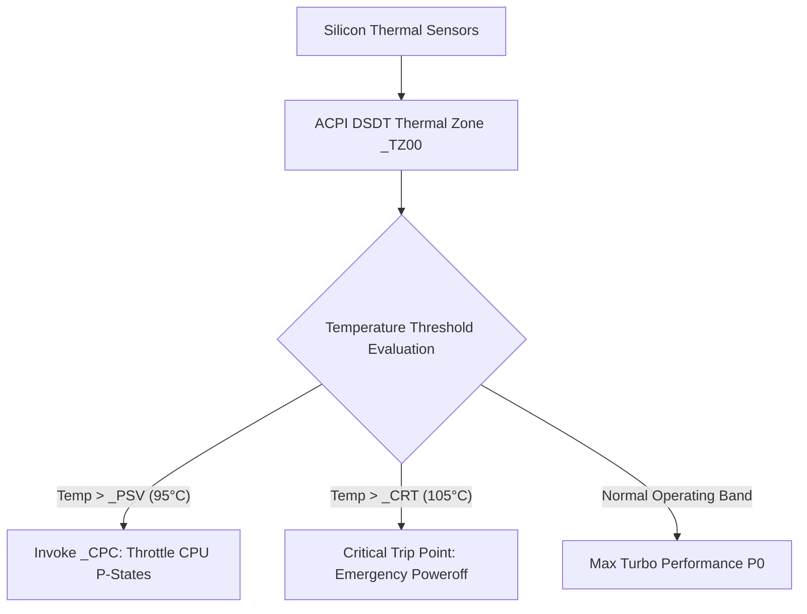

# 04 - ACPI Power & Thermal Diagnostics Architecture (ASL)

## Executive Overview
Low-level platform firmware engineering in **ACPI Source Language (ASL)**. It implements **Collaborative Processor Performance Control (_CPC)**, dynamic thermal management zones (`_TZ00`), passive/active cooling policies (`_PSV`, `_AC0`), and hardware-enforced power caps for high-density enterprise server racks.

## System Architecture



### Components
- **`src/DSDT.asl`**: Differentiated System Description Table defining CPU performance objects and thermal trip points.
- **`src/SSDT_POWER.asl`**: Secondary System Description Table defining dynamic rack-level power capping interfaces.
- **`src/build_asl.sh`**: Compilation script targeting Intel iASL compiler.
- **`runner/run.js`**: ASL bytecode virtual machine validating ACPI method evaluation and thermal trip transitions.

## Native Compilation with Intel iASL
```bash
# Compile ASL to binary AML bytecode
iasl -tc src/DSDT.asl
iasl -tc src/SSDT_POWER.asl
```

## Universal Verification
```bash
node runner/run.js
node orchestrator/run.js --project=04-asl
```

## Senior Interview Q&A
- **Q: What is the role of _CPC versus legacy P-states?** CPPC allows autonomous hardware frequency scaling on modern AMD and Intel silicon via MSR registers, reducing operating system latency from milliseconds to microseconds.
- **Q: How does ACPI guarantee safety under thermal runaway?** The critical trip point `_CRT` triggers an unmaskable hardware shutdown in the Embedded Controller (EC) independent of OS responsiveness.\n